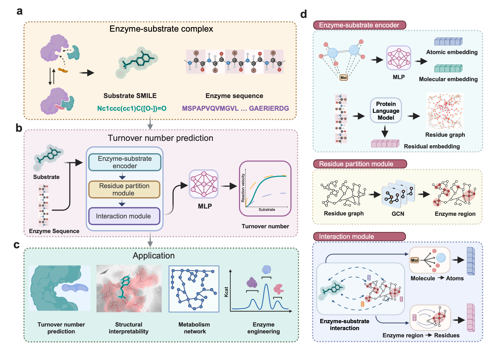

# KcatNet: A Geometric Deep Learning Framework for Genome-Wide Prediction of Enzyme Catalytic Efficiency


## Background

We introduced KcatNet, a geometric deep learning model for high-throughput prediction of turnover number in metabolic enzymes across all organisms, leveraging paired enzyme sequence data and substrate Simplified Molecular Input Line Entry System (SMILES) representations.




## Installation
KcatNet is implemented using Python 3.9.12 and various scientific computing packages (numpy, biopython, scikit-learn, torch). We recommend creating a dedicated virtual environment and installing the same package versions.

```
conda env create -f environment_gpu.yml
```

Alternatively, command lines can be helpful in setting up the environment (tested on linux with python 3.9), this can be done in few lines using Anaconda (https://www.anaconda.com).

```
conda create --name turnover python=3.9
conda activate turnover
conda install pytorch==1.11.0 torchvision==0.12.0 torchaudio==0.11.0 -c pytorch 
```

KcatNet utilizes pre-trained protein language model protT5 and ESM for protein residual embedding and evolutionary information extraction. 

(1) Install protT5

```
pip install transformers 
```

(2) Install ESM

```
pip install "fair-esm"
```
Note: The language model protT5 (referring to https://github.com/agemagician/ProtTrans) can also be downloaded for offline use.

We also included a pretrained molecular language modoel SMILES Transformer to generate substrate representation, the link is also provided on  [SMILES Transformer](https://github.com/DSPsleeporg/smiles-transformer).


## Predicting enzyme turnover number using enzyme sequence and one substrate SMILE

The script pred_kcat.py can be utilized to predict the enzyme turnover number given an enzyme sequence and substrate SMILE pair:

```
python pred_kcat.py 
```
we give several enzyme-substrate pairs as example in the examples/example.xlsx, where each pair included the enzyme sequence and one substrate SMILE:

 | Pro_seq            |         Smile         | Predicted Kcats |
|:----------------------|:---------------------:|----------------:|
| MALKLNPFLSQTQKLPS.... | O=P(O)(O)OC[C@H]1O... |   0.755690265807342       |
| MVQDRKSTVVITGASSG.... |         [H+]          |     0.247781748919223     |

## Training from scratch on the enzyme turnover number data set
Enzyme turnover number datasets used for model development and evaluation are provided in the ./Dataset folder. The model can be Trained from scratch via:

```
python train.py
```

## Contact
For any question and comment regarding the code, please reach out to
tong.pan@monash.edu
